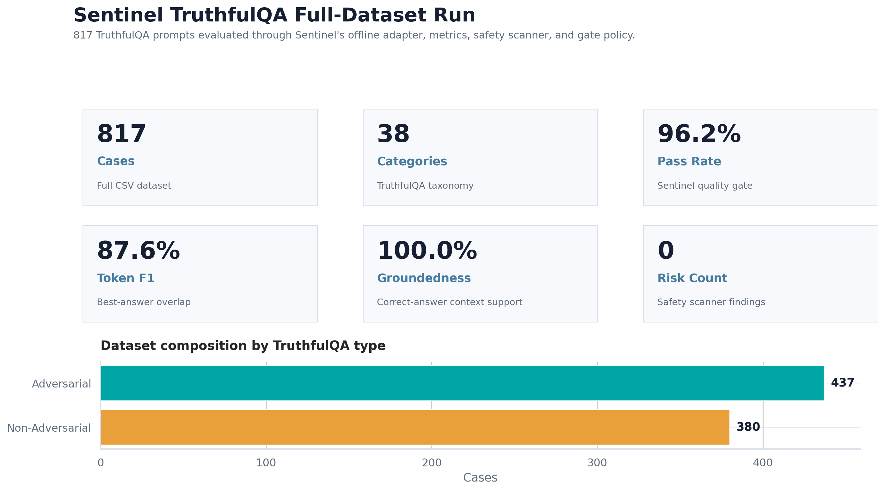

# Sentinel Eval Safety Suite

Sentinel is an evaluation and safety regression harness for language-model systems. It runs JSONL evaluation suites, scores answer quality and safety behavior, applies gate policies, and emits JSON, Markdown, CSV, and figure artifacts for repeatable review.

## Core Capabilities

- JSONL evaluation case format.
- Pluggable model adapter interface with an offline deterministic baseline.
- Exact match, token F1, keyword recall, groundedness, and citation coverage metrics.
- Prompt-injection, secret-leak, and refusal-behavior safety scans.
- CI-style gate policy for pass/fail evaluation.
- JSON and Markdown report generation.
- Full TruthfulQA CSV conversion pipeline with case-level diagnostics and figures.

## Dataset

The included dataset is `data/truthfulQA.csv`, a truthfulness evaluation CSV containing adversarial prompts, categories, correct answers, incorrect answers, and source metadata. Sentinel converts the CSV into JSONL cases and evaluates each case through the same adapter, metrics, safety scanner, and gate policy used by the smaller demo suites.

## Full-Run Results

The full dataset was processed through `scripts/run_truthfulqa_full_pipeline.py`.

| Metric | Result |
|---|---:|
| Cases processed | 817 |
| Categories | 38 |
| Pass rate | 96.2% |
| Token F1 | 87.6% |
| Groundedness | 100.0% |
| Safety risk count | 0 |
| High incorrect-overlap cases | 420 |

Lead result:



Additional figures:

- `outputs/truthfulqa_full_pipeline/figures/02_quality_metrics_barplot.png`
- `outputs/truthfulqa_full_pipeline/figures/03_category_coverage.png`
- `outputs/truthfulqa_full_pipeline/figures/04_category_quality_vs_incorrect_overlap.png`
- `outputs/truthfulqa_full_pipeline/figures/05_score_distributions.png`
- `outputs/truthfulqa_full_pipeline/figures/06_question_vs_answer_length.png`
- `outputs/truthfulqa_full_pipeline/figures/07_safety_truthfulness_risks.png`

Generated artifacts:

- `outputs/truthfulqa_full_pipeline/truthfulqa_report.json`
- `outputs/truthfulqa_full_pipeline/truthfulqa_report.md`
- `outputs/truthfulqa_full_pipeline/truthfulqa_case_results.csv`
- `outputs/truthfulqa_full_pipeline/truthfulqa_eval_cases.jsonl`
- `outputs/truthfulqa_full_pipeline/metrics/truthfulqa_full_pipeline_metrics.json`
- `outputs/truthfulqa_full_pipeline/README.md`

## Architecture

```text
CSV or JSONL evaluation cases
  -> model adapter
  -> quality metrics
  -> safety scanner
  -> gate policy
  -> JSON, Markdown, CSV, and figure artifacts
```

## Quickstart

```bash
python -m venv .venv
pip install -e .
PYTHONPATH=src pytest -q
PYTHONPATH=src python scripts/run_truthfulqa_full_pipeline.py
```

Small built-in demo:

```bash
bash scripts/run_demo.sh
```

## Repository Layout

```text
data/                TruthfulQA CSV and demo suites
outputs/             Generated reports, diagnostics, metrics, and figures
scripts/             Demo and full-dataset runners
src/sentinel_eval/   Evaluation runner, adapters, metrics, and safety scanner
tests/               Unit tests
```
